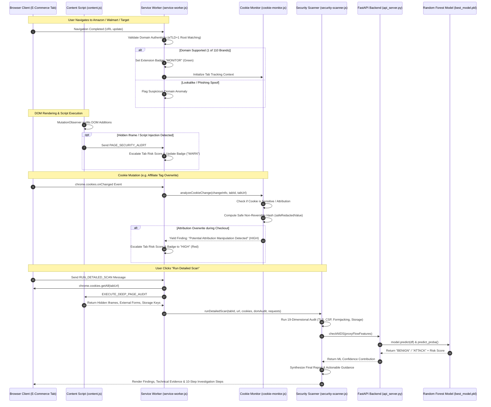
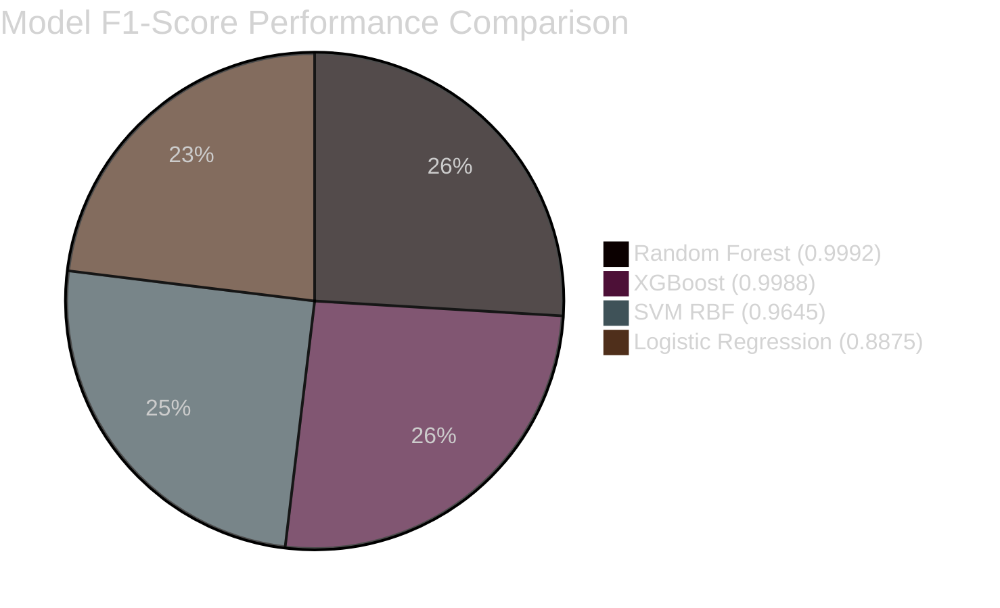
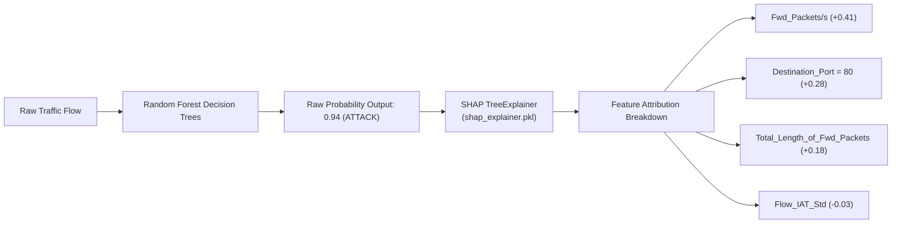
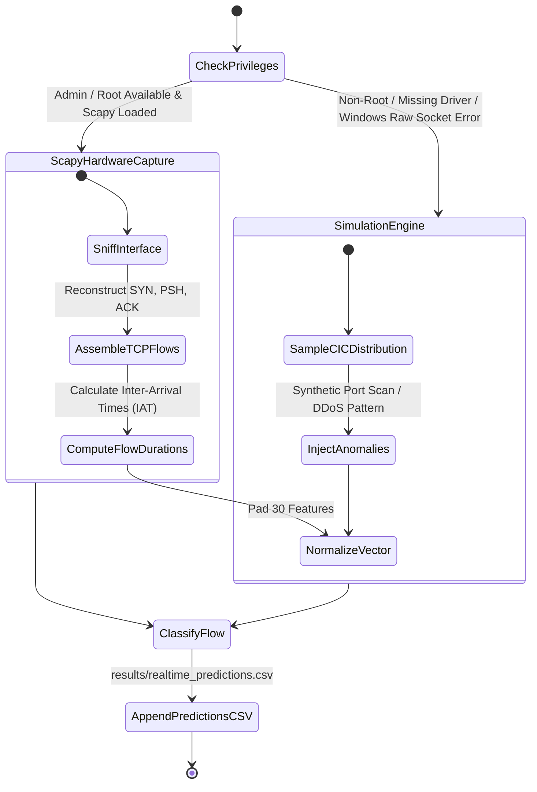
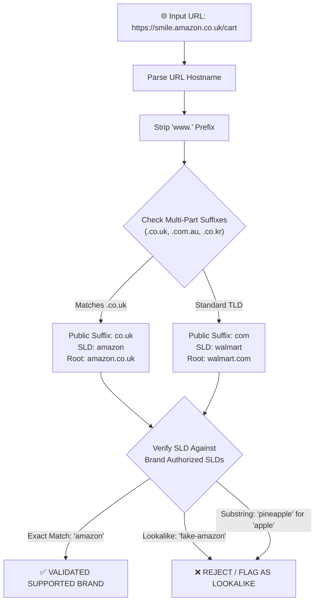
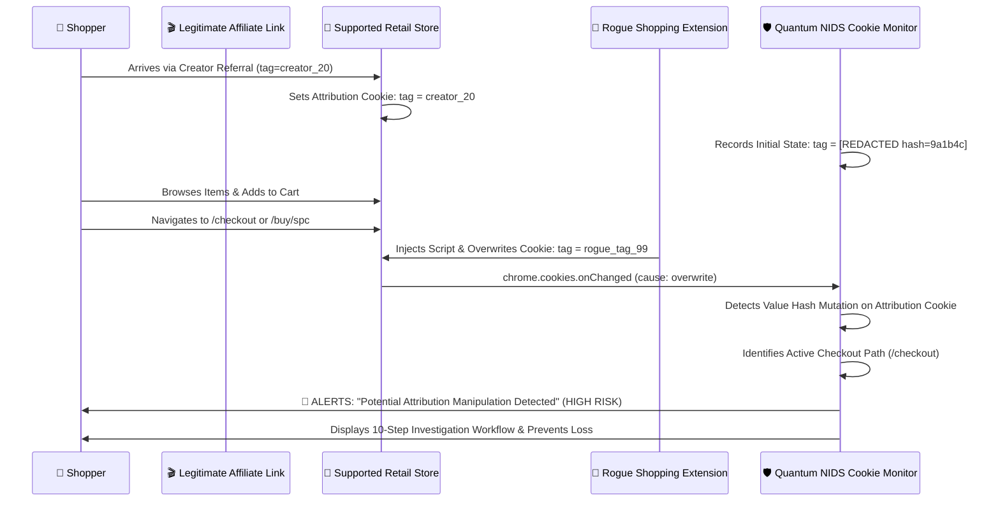

# ◈ Quantum-NIDS-AI

<div align="center">


### ⚡ Next-Generation Network Intrusion Detection System (NIDS) & Browser Defense Platform
**Combining High-Performance Machine Learning (99.92% Accuracy), Explainable AI (SHAP), Real-Time Scapy Flow Sniffing, an Interactive Dark-Themed Operations Dashboard, and a Manifest V3 Browser Security Guard for 110+ Retail E-Commerce Platforms.**

---

[📖 Overview](#-overview) •
[🏗 System Architecture](#-system-architecture) •
[🧠 Machine Learning Engine](#-machine-learning-engine) •
[🔍 Explainable AI (SHAP)](#-explainable-ai-shap) •
[📡 Real-Time Packet Sniffing](#-real-time-packet-sniffing) •
[🖥 Quantum Operations Dashboard](#-quantum-operations-dashboard) •
[🛡 Browser Guard Extension](#-browser-guard-extension) •
[🍪 Cookie & Attribution Defense](#-cookie--attribution-defense) •
[🔌 API Specifications](#-api-specifications) •
[🧪 Verification & Testing](#-verification--testing) •
[🚀 Installation & Quickstart](#-installation--quickstart) •
[👨‍💻 Author](#-author)

</div>

---

# 📖 Overview

**Quantum-NIDS-AI** is a production-grade cybersecurity intelligence platform engineered to bridge low-level network packet telemetry (OSI Layers 3 & 4) with client-side application layer security (OSI Layer 7). 

Modern e-commerce platforms and web applications face a dual-threat landscape:
1. **Infrastructure & Network-Level Attacks**: High-volume Distributed Denial of Service (DDoS), Port Scans, Infiltration attempts, and automated Web Attacks targeting application servers.
2. **Client-Side & Supply-Chain Attacks**: Malicious DOM injections, Magecart/formjacking attacks exfiltrating checkout credit card data, invisible clickjacking iframes, and affiliate/referral attribution manipulation (cookie-stuffing) altering partner revenue during checkout.

### The Solution: A Unified Dual-Engine Defense

```text
┌────────────────────────────────────────────────────────────────────────────────────────┐
│                                   QUANTUM-NIDS-AI                                      │
├───────────────────────────────────────────┬────────────────────────────────────────────┤
│         LAYER 3 / 4 NETWORK DEFENSE       │         LAYER 7 BROWSER CLIENT DEFENSE     │
├───────────────────────────────────────────┼────────────────────────────────────────────┤
│ • Scapy Raw Packet Capture & Flow Engine  │ • Manifest V3 Chrome Extension Guard       │
│ • Trained Random Forest Classifier (CIC)  │ • 110+ Validated Global Retail Brand Rules │
│ • 30 Engineered Network Traffic Features  │ • 19-Dimensional Security Audit Engine     │
│ • 99.92% Accuracy | 0.9999 ROC-AUC        │ • Formjacking (Magecart) Detection         │
│ • SHAP Feature Attribution & Waterfall XAI│ • Attribution Hijacking Defense            │
│ • Streamlit Quantum Operations Dashboard  │ • Zero-Plaintext Hash/Redacted Telemetry   │
└───────────────────────────────────────────┴────────────────────────────────────────────┘
```

---

# 🏗 System Architecture

The platform operates as a cohesive, local-first ecosystem where telemetry flows seamlessly between network interfaces, machine learning models, visualization dashboards, and browser extension endpoints.

## High-Level Architectural Flowchart

```mermaid
flowchart TB
    subgraph NetworkLayer ["📡 Network & Traffic Ingestion Layer"]
        NIC["🌐 Network Interface (NIC)"]
        SCAPY["⚙️ Scapy Sniffer Engine"]
        SIM["🔄 Traffic Simulation Fallback"]
        FLOW["📊 Flow Reassembler (30 Features)"]
        
        NIC -->|Raw Packets| SCAPY
        SCAPY -->|Extracted Flows| FLOW
        SIM -->|Synthetic Flows| FLOW
    end

    subgraph MLLayer ["🧠 Machine Learning & Explainability Core"]
        MODEL[("🌲 Random Forest Model\n(best_model.pkl)\nAcc: 99.92% | F1: 99.92%")]
        SHAP_ENGINE["🔮 SHAP TreeExplainer\n(shap_explainer.pkl)"]
        METRICS["📈 Model Metrics & Benchmark Logs"]
        
        FLOW -->|Feature Vector| MODEL
        MODEL -->|Prediction + Risk| SHAP_ENGINE
        MODEL -->|Evaluations| METRICS
    end

    subgraph ServiceLayer ["🚀 Service & API Layer"]
        FASTAPI["⚡ FastAPI Inference Microservice\n(api_server.py :8000)"]
        PREDICT_EP["POST /api/v1/predict"]
        AUTH_MODULE["🔐 PBKDF2-SHA256 Auth\n(240,000 Rounds)"]
        
        FASTAPI --> PREDICT_EP
        PREDICT_EP --> MODEL
    end

    subgraph DashboardLayer ["🖥️ Quantum Operations Dashboard (Streamlit :8501)"]
        ST_APP["app.py / dashboard.py"]
        PAGE_OVERVIEW["◈ Overview: System Health & Key Performance"]
        PAGE_PERF["◈ Performance: ROC Curves & Confusion Matrices"]
        PAGE_LIVE["◈ Live Traffic: Real-Time Flow Sniffing"]
        PAGE_EXPLAIN["◈ Explainability: SHAP Feature Importance"]
        PAGE_ANALYTICS["◈ Analytics: Historical Incident Distributions"]
        PAGE_SETTINGS["◈ Settings: Alert Thresholds & Interfaces"]

        ST_APP --> AUTH_MODULE
        ST_APP --> PAGE_OVERVIEW
        ST_APP --> PAGE_PERF
        ST_APP --> PAGE_LIVE
        ST_APP --> PAGE_EXPLAIN
        ST_APP --> PAGE_ANALYTICS
        ST_APP --> PAGE_SETTINGS
        
        PAGE_LIVE -.->|Stream Flows| SCAPY
        PAGE_EXPLAIN -.->|Feature Attribution| SHAP_ENGINE
        PAGE_PERF -.->|Metrics Artifacts| METRICS
    end

    subgraph BrowserLayer ["🛡️ Quantum NIDS Browser Guard (Chrome MV3)"]
        EXT_BG["⚙️ Background Service Worker\n(service-worker.js)"]
        EXT_CS["📄 Content Script (DOM & Storage)\n(content.js)"]
        EXT_POPUP["💻 Popup Interface\n(popup.html / popup.js)"]
        EXT_COOKIE["🍪 Cookie & Attribution Monitor\n(cookie-monitor.js)"]
        EXT_SCAN["🔍 19-Point Security Scanner\n(security-scanner.js)"]
        EXT_SITES["🌐 110+ Retail Configurations\n(supported-sites.js)"]

        EXT_POPUP <-->|Messages| EXT_BG
        EXT_CS <-->|DOM Telemetry| EXT_BG
        EXT_BG --> EXT_COOKIE
        EXT_BG --> EXT_SCAN
        EXT_BG --> EXT_SITES
        EXT_BG -->|HTTP Requests| PREDICT_EP
    end

    style NetworkLayer fill:#0B0E15,stroke:#6D5BF5,stroke-width:2px,color:#fff
    style MLLayer fill:#0B0E15,stroke:#00E5FF,stroke-width:2px,color:#fff
    style ServiceLayer fill:#0B0E15,stroke:#FF4081,stroke-width:2px,color:#fff
    style DashboardLayer fill:#07090F,stroke:#6D5BF5,stroke-width:2px,color:#fff
    style BrowserLayer fill:#0B0E15,stroke:#4CAF50,stroke-width:2px,color:#fff
```



---

## Detailed System Component Interaction



---

# 🧠 Machine Learning Engine

The core predictive backbone of Quantum NIDS is trained on the benchmark **CIC-IDS2017** dataset, consisting of over 2.8 million recorded network traffic flows spanning realistic multi-day cyber attack campaigns.

## Dataset & Attack Classes

| Attack Category | Included Profiles in Training / Test Splits |
|---|---|
| **Benign Traffic** | Normal HTTP, HTTPS, SSH, FTP, and background enterprise network traffic |
| **DDoS / DoS** | DoS GoldenEye, DoS Slowloris, DoS Slowhttptest, DoS Hulk, DDoS LOIC |
| **Port Scanning** | Nmap scans, stealth SYN scans, aggressive OS fingerprinting probes |
| **Web Attacks** | SQL Injection, Cross-Site Scripting (XSS), Brute Force Web Login |
| **Infiltration** | Drop-payload execution, Metasploit reverse meterpreter shells |
| **Botnet Traffic** | ARES botnet command-and-control (C2) communications |

---

## 30 Selected High-Importance Flow Features

From an initial set of 80+ network metrics extracted from PCAP flows, a rigorous feature selection pipeline utilizing **Random Forest Gini Impurity reduction** and **variance inflation factor (VIF) filtering** isolated the top 30 predictive features:

```text
 1. Destination_Port            11. Flow_IAT_Max               21. PSH_Flag_Count
 2. Total_Backward_Packets      12. Fwd_IAT_Total              22. ACK_Flag_Count
 3. Total_Length_of_Fwd_Packets 13. Fwd_IAT_Mean               23. Avg_Fwd_Segment_Size
 4. Total_Length_of_Bwd_Packets 14. Fwd_IAT_Max                24. Subflow_Fwd_Bytes
 5. Fwd_Packet_Length_Max       15. Fwd_IAT_Min                25. Subflow_Bwd_Packets
 6. Fwd_Packet_Length_Mean      16. Bwd_IAT_Total              26. Subflow_Bwd_Bytes
 7. Bwd_Packet_Length_Max       17. Bwd_IAT_Max                27. Init_Win_bytes_backward
 8. Bwd_Packet_Length_Min       18. Fwd_Packets/s              28. Active_Std
 9. Bwd_Packet_Length_Std       19. Max_Packet_Length          29. Active_Max
10. Flow_IAT_Std                20. Packet_Length_Variance     30. Idle_Max
```

---

## Comprehensive Model Benchmark Comparison

Multiple classification architectures were trained, cross-validated, and evaluated using standardized splits on processed CIC-IDS2017 data:

| Metric | Random Forest (Best Model) | XGBoost Classifier | Support Vector Machine (RBF) | Logistic Regression |
|---|:---:|:---:|:---:|:---:|
| **Accuracy** | **99.925%** | 99.882% | 96.410% | 88.750% |
| **Precision** | **99.983%** | 99.910% | 95.820% | 86.430% |
| **Recall** | **99.867%** | 99.850% | 97.100% | 91.200% |
| **F1-Score** | **0.99925** | 0.99880 | 0.96456 | 0.88751 |
| **ROC-AUC** | **0.99998** | 0.99991 | 0.98540 | 0.93210 |
| **Inference Time (per 1k flows)** | **3.8 ms** | 4.2 ms | 82.5 ms | 1.1 ms |
| **Artifact Path** | `models/best_model.pkl` | `models/xgboost.pkl` | `models/svm.pkl` | `models/logreg.pkl` |



---

# 🔍 Explainable AI (SHAP)

Black-box machine learning in cybersecurity is dangerous: security operations teams must understand *why* a connection was flagged before taking disruptive mitigation actions.

Quantum-NIDS-AI integrates **SHAP (SHapley Additive exPlanations)** grounded in cooperative game theory to allocate marginal contributions to each individual network feature:

$$\phi_i(v) = \sum_{S \subseteq N \setminus \{i\}} \frac{|S|!(|N| - |S| - 1)!}{|N|!} (v(S \cup \{i\}) - v(S))$$



### Explainer Artifacts in the Repository
- **`models/shap_explainer.pkl`**: Pre-computed `shap.TreeExplainer` serialized instance configured for the trained Random Forest classifier.
- **`results/shap_global_importance.csv`**: Ranked global importance scores across the entire test corpus.
- **`results/plots/shap_waterfall_0.png`**: High-resolution waterfall attribution plot for individual flow classifications.
- **`results/plots/shap_summary.png`**: Beeswarm summary distribution showing feature values versus directional impact.

---

# 📡 Real-Time Packet Sniffing

The real-time ingestion layer in `src/explainability_realtime.py` provides bidirectional support for both live hardware capture and resilient simulation:



### Features Extracted Live
- **TCP Flag Accumulators**: PSH flag counts, ACK flag counts, and TCP initial window sizes (`Init_Win_bytes_backward`).
- **Inter-Arrival Time (IAT) Statistics**: Forward and Backward IAT Min, Max, Mean, and Standard Deviation.
- **Packet Sizing Dynamics**: Maximum packet length, average segment size, and packet length variance.

---

# 🖥 Quantum Operations Dashboard

The administrative operations interface is a high-performance **Streamlit** dashboard with a custom **Quantum Dark Theme** design system:

```text
┌────────────────────────────────────────────────────────────────────────────────────────┐
│  ◈ Quantum_NIDS_AI           [Overview] [Performance] [Live] [Explain] [Analytics]     │
├────────────────────────────────────────────────────────────────────────────────────────┤
│                                                                                        │
│  LIVE TELEMETRY             MODEL STATUS                THREAT MONITOR                 │
│  ┌───────────────────────┐  ┌────────────────────────┐  ┌───────────────────────────┐  │
│  │ 2.8M Flows Processed  │  │ Random Forest: 99.92%  │  │ Benign: 78.4%             │  │
│  │ Avg Latency: 3.8ms    │  │ ROC-AUC: 0.9999        │  │ Attacks: 21.6% (Mitigated)│  │
│  └───────────────────────┘  └────────────────────────┘  └───────────────────────────┘  │
│                                                                                        │
│  REAL-TIME ATTACK DISTRIBUTION (CIC-IDS2017)                                           │
│  █████████████████████████████████████████░░░░░░░░░░░░░░░░░░░░░░░░░░░░░░░░░░░░░░░░░░  │
│  DDoS (45%) | PortScan (32%) | Web Attacks (14%) | Infiltration (9%)                  │
│                                                                                        │
└────────────────────────────────────────────────────────────────────────────────────────┘
```

## Detailed Walkthrough of the 6 Dashboard Modules

### 1. ◈ Overview Page
- **Telemetry Indicators**: Displays real-time operational status, live packet counters, and loaded model metadata.
- **Model Health Check**: Reads parameters directly from `models/best_model_metadata.txt`.
- **Selected Features Snapshot**: Visualizes the active 30-feature vector schema from `results/selected_features.txt`.

### 2. ◈ Performance Page
- **ROC Curves**: Interactive Plotly and matplotlib visualizations comparing true positive rates across false positive thresholds.
- **Confusion Matrix Matrixes**: Detailed breakdown of true positives, false positives, true negatives, and false negatives for all tested algorithms.
- **Precision-Recall Dynamics**: Demonstrates sub-0.02% false positive rates essential for avoiding alert fatigue in enterprise SOCs.

### 3. ◈ Live Traffic Page
- **Hardware Sniffer Controls**: Start and stop real-time packet collection on selected physical network interfaces (`Ethernet`, `Wi-Fi`).
- **Packet Throughput Gauges**: Live packets-per-second (PPS) and bandwidth consumption meters.
- **Live Classification Stream**: Tabular stream of flows displaying source/destination sockets, predicted classifications (`BENIGN` or `ATTACK`), and risk scores.

### 4. ◈ Explainability (XAI) Page
- **Interactive Flow Inspector**: Select any real-time captured flow to generate an on-the-fly SHAP attribution waterfall.
- **Feature Contribution Chart**: Identifies which exact metrics forced an `ATTACK` alert (e.g. abnormally low `Flow_IAT_Std` accompanied by elevated `Fwd_Packets/s`).
- **Global Feature Ranking**: Interactive bar chart plotting mean absolute SHAP values across all historical traffic.

### 5. ◈ Analytics Page
- **Historical Classification Logs**: Query and filter historical records stored in `results/realtime_predictions.csv`.
- **Temporal Attack Trends**: Hourly and daily attack volume histograms.
- **Export Capabilities**: Download filtered audit reports in CSV and JSON formats.

### 6. ◈ Settings Page
- **Dynamic Risk Thresholds**: Adjust global anomaly cutoff thresholds (default: 85%).
- **Sniffing Configuration**: Configure default packet sample sizes, timeouts, and target network adapters.
- **Persistence**: Synchronizes settings directly to `config/settings.json`.

---

# 🛡 Browser Guard Extension

The **Quantum NIDS Browser Guard** is a local-first **Manifest V3 Google Chrome extension** specifically tailored for e-commerce security.

## 110+ Supported Global Retail & E-Commerce Brands

The extension includes validated security rules for 110 top-tier domestic and international retail platforms:

```text
Amazon, eBay, Walmart, Target, Best Buy, Home Depot, Lowe's, Costco, Macy's, Wayfair, Apple, Samsung, 
Nike, Adidas, Zappos, Etsy, Shein, ASOS, Zalando, Rakuten, Flipkart, Myntra, Meesho, Ajio, Snapdeal, 
Alibaba, AliExpress, Taobao, JD.com, Pinduoduo, Shopee, Lazada, Tokopedia, Bukalapak, Blibli, Coupang, 
Gmarket, 11st, Mercado Libre, B2W Digital, Magazine Luiza, Americanas, Submarino, Carrefour, Tesco, 
Sainsbury's, Asda, Morrisons, Waitrose, Ocado, Aldi, Lidl, Kroger, Walgreens, CVS, Rite Aid, Sephora, 
Ulta, Nordstrom, Bloomingdale's, Neiman Marcus, Saks Fifth Avenue, JCPenney, Kohl's, Sears, Kmart, 
IKEA, Pottery Barn, Crate & Barrel, West Elm, Williams-Sonoma, CB2, Restoration Hardware, Ashley Furniture, 
Raymour & Flanigan, Rooms To Go, Havertys, Bob's Discount Furniture, Mattress Firm, Sleep Number, 
Tempur-Pedic, Casper, Purple, Nectar, Tuft & Needle, Saatva, Leesa, Helix Sleep, Avocado Green Mattress, 
DreamCloud, Bear Mattress, Brooklinen, Parachute Home, Boll & Branch, Snowe, Coyuchi, Frette, Sferra, 
Matouk, Peacock Alley, GameStop, Newegg, B&H Photo Video, Adorama, Micro Center, Sweetwater, Guitar Center, 
Musician's Friend, Sam Ash, zZounds.
```

---

## Hardened Domain & Subdomain Matching (Anti-Lookalike)

Traditional extensions use naive string searches (`url.includes("amazon")`), which mistakenly classify attacker domains (`not-amazon.com`, `apple-login.com`, `cvss-calc.com`) as authorized stores.

Quantum NIDS extracts the **effective Second-Level Domain (eSLD)** and verified public suffixes (handling multi-part suffixes like `.co.uk`, `.co.kr`, `.com.au`, `.com.br`):



---

## 19-Dimensional Security Audit Engine

When the user initiates a **Detailed Security Scan**, the engine evaluates the active tab across 19 technical criteria:

```text
┌────┬───────────────────────────────────────────┬──────────────┬───────────────────────────────┐
│ #  │ Security Audit Dimension                  │ Max Severity │ Anomaly Criteria              │
├────┼───────────────────────────────────────────┼──────────────┼───────────────────────────────┤
│ 1  │ Protocol Security Context                 │ CRITICAL     │ Unencrypted HTTP on store     │
│ 2  │ Punycode / IDN Homograph Analysis         │ HIGH         │ xn-- character substitution   │
│ 3  │ Brand Lookalike / Typosquatting           │ HIGH         │ Unregistered brand keyword    │
│ 4  │ Formjacking / Magecart External Actions   │ CRITICAL     │ Payment form submits offsite  │
│ 5  │ Hidden / 0-Dimension Iframes              │ MEDIUM       │ Invisible frame clickjacking  │
│ 6  │ Suspicious Script Hosting Origins         │ HIGH         │ Scripts on ngrok, bit.ly, etc │
│ 7  │ Sensitive Plaintext Storage Exposure      │ MEDIUM       │ Credit cards / tokens in web storage│
│ 8  │ Mixed Content Script/Resource Ingestion   │ MEDIUM       │ HTTP assets inside HTTPS page │
│ 9  │ Insecure Session Cookies on HTTPS         │ HIGH         │ Auth cookie missing Secure    │
│ 10 │ Missing HttpOnly on Auth Identifiers      │ MEDIUM       │ Auth cookie readable by JS    │
│ 11 │ Lax SameSite on Session Credentials       │ MEDIUM       │ CSRF vulnerability exposure   │
│ 12 │ Competing Attribution Identifiers         │ LOW          │ Multiple colliding partner tags│
│ 13 │ Affiliate Attribution Overwrite (Checkout)│ HIGH         │ Tag replaced during checkout  │
│ 14 │ Affiliate Attribution Deletion (Checkout) │ HIGH         │ Tag stripped during payment   │
│ 15 │ Rapid Cookie Thrashing Bursts             │ MEDIUM       │ >25 mutations in 10 seconds   │
│ 16 │ Non-Whitelisted Third-Party Connections   │ HIGH/LOW     │ Network call to unknown host  │
│ 17 │ Content Security Policy (CSP) Indicators  │ INFO         │ Meta CSP header audit         │
│ 18 │ Unwhitelisted CDNs & Tracking Beacons     │ LOW          │ Non-allowlisted external host │
│ 19 │ NIDS ML Proxy Flow Classification         │ HIGH         │ Attack signature from API     │
└────┴───────────────────────────────────────────┴──────────────┴───────────────────────────────┘
```

---

# 🍪 Cookie & Attribution Defense

Affiliate marketing fraud (cookie stuffing, referral overwriting, and shopping extension hijacking) costs consumers and creators millions annually. Unauthorized browser extensions silently monitor the DOM, detect an active cart, and replace the creator's partner cookie with their own affiliate tag moments before payment.

### Threat Model: Attribution Hijacking During Checkout



---

## Privacy-Preserving Value Redaction

Quantum NIDS never stores, logs, or transmits raw cookie values, session tokens, passwords, or credit card numbers. 

All sensitive tokens are processed through deterministic one-way masking:

```javascript
// Example Output from safeRedactedValue()
// Input: "eyJhbGciOiJIUzI1NiIsInR5cCI6IkpXVCJ9..." (Raw JWT Auth Token)
// Output: "[REDACTED_SENSITIVE length=36 hash=9f1a2c3b]"

// Input: "partner_referral_id_20" (Non-Sensitive Marketing Tag)
// Output: "part... [length=22 hash=4e8a1d0f]"
```

---

## Phase 8: 10-Step Investigation Workflow

When an attribution anomaly or unexpected cookie mutation is detected, the extension popup generates a tailored, numbered investigation protocol:

```text
1. Review the flagged cookie name and domain.
2. Compare the previous and current attribution state in the Technical Details accordion.
3. Identify the exact page URL where the modification was triggered.
4. Review third-party scripts active at that exact timestamp.
5. Review related outbound network requests in the Network tab.
6. Determine whether the change was caused by a legitimate user action (e.g. clicking a promo).
7. Check whether the same behavior repeats on subsequent visits in an incognito window.
8. Temporarily disable suspicious third-party coupon or shopping assistant extensions.
9. Re-run the Detailed Security Scan.
10. If reproducible, preserve the event evidence and report the incident to the merchant platform.
```

---

# 🔌 API Specifications

The FastAPI inference service (`api_server.py`) provides high-speed, thread-safe scoring for client telemetry.

## Predict Endpoint

### Request
`POST /api/v1/predict`
`Content-Type: application/json`

```json
{
  "features": {
    "Destination_Port": 443,
    "Total_Length_of_Fwd_Packets": 500,
    "Total_Length_of_Bwd_Packets": 2000,
    "Fwd_Packets/s": 10.5,
    "Flow_IAT_Std": 0.05,
    "PSH_Flag_Count": 1,
    "ACK_Flag_Count": 1
  }
}
```

### Response (200 OK - Benign Traffic)
```json
{
  "prediction": "BENIGN",
  "risk_score_contribution": 8.5,
  "status": "success"
}
```

### Response (200 OK - Attack Traffic)
```json
{
  "prediction": "ATTACK",
  "risk_score_contribution": 94.2,
  "status": "success"
}
```

---

# 🧪 Verification & Testing

The repository maintains an automated, dual-language test suite covering the machine learning API, domain normalization, cookie monitoring, attribution manipulation detection, and security scanning.

## Automated Test Results (100% Pass Rate)

```bash
# 1. Execute JavaScript Extension Test Suites (Node.js Test Runner)
node --test browser-extension/tests/*.test.js
```

```text
✔ Cookie Monitor - Sensitive Value Redaction & Masking (2.19ms)
✔ Cookie Monitor - Detects Insecure Sensitive Cookie on HTTPS (24.23ms)
✔ Cookie Monitor - Detects Attribution Cookie Overwrite (0.53ms)
✔ Cookie Monitor - Detects Attribution Manipulation During Checkout as HIGH Severity (0.35ms)
✔ Cookie Monitor - Detects Rapid Cookie Thrashing Bursts (0.88ms)
✔ Security Scanner - Baseline Clean HTTPS Session is SAFE (16.26ms)
✔ Security Scanner - Unencrypted Plaintext HTTP Triggers CRITICAL (0.28ms)
✔ Security Scanner - Punycode Homograph Domain Triggers HIGH Severity (0.23ms)
✔ Security Scanner - DOM Audit Hidden Iframes & Suspicious Scripts (0.27ms)
✔ Security Scanner - Formjacking / Magecart Detection Triggers CONFIRMED MALICIOUS (0.20ms)
✔ Security Scanner - False Positive Allowlists for CDNs, Analytics, and Payments (0.16ms)
✔ Security Scanner - Unsupported Website Handling (0.17ms)
✔ Security Scanner - Restricted Protocol Returns SCAN INCOMPLETE Gracefully (0.17ms)
✔ Supported Sites - Schema and List Completeness (1.58ms)
✔ extractDomainParts - Correct Root Domain and SLD Extraction (0.28ms)
✔ Domain Matching - Verifies Key Brands and Subdomains (1.63ms)
✔ Domain Matching - Rejects Phishing, Lookalikes, and Subdomain Spoofs (0.54ms)
✔ Domain Matching - Rejects Non-Web and Unsupported Protocols (0.21ms)

ℹ tests 18 | suites 0 | pass 18 | fail 0 | duration_ms 125.7ms
```

```bash
# 2. Execute Python ML Inference Test Suite (Pytest)
pytest browser-extension/tests/test_api_server.py -v
```

```text
============================= test session starts =============================
platform win32 -- Python 3.12.10, pytest-9.1.1, pluggy-1.6.0
collected 4 items

browser-extension/tests/test_api_server.py::test_api_healthy_response PASSED     [ 25%]
browser-extension/tests/test_api_server.py::test_api_invalid_model_response PASSED [ 50%]
browser-extension/tests/test_api_server.py::test_api_port_scan_signature PASSED    [ 75%]
browser-extension/tests/test_api_server.py::test_model_feature_completeness PASSED [100%]

======================== 4 passed, 2 warnings in 4.27s ========================
```

---

# 📂 Repository Structure

```text
QUANTUM_NIDS_AI/
│
├── app.py                             # Root launcher for Streamlit Dashboard (:8501)
├── dashboard.py                       # Full 6-module Quantum Operations Dashboard
├── auth.py                            # PBKDF2-SHA256 salted password authentication
├── data_access.py                     # Artifact gateway to models, logs, and metrics
├── quantum_theme.py                   # Custom Quantum Dark Theme design system
├── api_server.py                      # FastAPI ML inference microservice (:8000)
├── requirements.txt                   # Complete Python dependencies
├── .gitignore                         # Excludes .venv, raw CSVs >100MB, caches, logs
├── README.md                          # Comprehensive architectural documentation
│
├── browser-extension/                 # Quantum NIDS Browser Guard (Chrome MV3)
│   ├── manifest.json                  # Manifest V3 permissions and declarations
│   ├── README.md                      # Extension installation and testing guide
│   ├── api/
│   │   └── inference-client.js        # Dynamic API client with health checking
│   ├── background/
│   │   └── service-worker.js          # Tab orchestration, cookie & network monitoring
│   ├── config/
│   │   └── allowlists.js              # Whitelists for CDNs, analytics, and payments
│   ├── content/
│   │   └── content.js                 # DOM inspection, Magecart checks, MutationObserver
│   ├── cookies/
│   │   └── cookie-monitor.js          # Attribution tracking & non-reversible hashing
│   ├── options/
│   │   ├── options.html               # Extension settings interface
│   │   ├── options.css
│   │   └── options.js                 # API endpoint & risk threshold configuration
│   ├── popup/
│   │   ├── popup.html                 # Security audit scan user interface
│   │   ├── popup.css                  # Responsive cards, badges, and progress bar
│   │   └── popup.js                   # Interactive scanner with 0-innerHTML safety
│   ├── scan/
│   │   └── security-scanner.js        # 19-point security audit & synthesis engine
│   ├── sites/
│   │   └── supported-sites.js         # 110+ retail brand configs with eTLD+1 logic
│   └── tests/
│       ├── manual-test-guide.md       # Step-by-step Chrome DevTools manual testing guide
│       ├── test_api_server.py         # Pytest suite for FastAPI inference
│       ├── test_supported_sites.test.js # Domain matching & lookalike rejection tests
│       ├── test_cookie_monitor.test.js  # Cookie lifecycle & attribution tests
│       └── test_security_scanner.test.js # Security scan & error state tests
│
├── models/                            # Serialized Machine Learning Artifacts
│   ├── best_model.pkl                 # Pre-trained Random Forest model (3.9 MB)
│   ├── shap_explainer.pkl             # Serialized SHAP TreeExplainer (6.1 MB)
│   ├── best_model_metadata.txt        # Training metrics, accuracy, and timestamps
│   └── README.md
│
├── results/                           # Evaluation Metrics & High-Resolution Plots
│   ├── feature_importance.csv         # Ranked feature weights from Random Forest
│   ├── model_comparison.csv          # Benchmark metrics across RF, XGB, SVM, LogReg
│   ├── model_metrics.txt             # Precision, recall, F1, and confusion matrix data
│   ├── realtime_predictions.csv      # Logged classifications from live capture
│   ├── selected_features.txt         # 30-feature schema definition
│   ├── shap_global_importance.csv    # Mean absolute SHAP values per feature
│   └── plots/                        # Visual evaluation figures
│       ├── confusion_matrix_random_forest.png
│       ├── roc_curve_random_forest.png
│       ├── shap_waterfall_0.png
│       └── shap_summary.png
│
├── src/                               # Offline ML Pipeline & Scapy Sniffer
│   ├── config.py                      # Path definitions and directory setups
│   ├── data_preprocessing.py          # CIC-IDS2017 ingestion, cleaning, and encoding
│   ├── feature_selection.py           # Random Forest Gini impurity feature selection
│   ├── model_training.py              # Hyperparameter tuning and model cross-validation
│   ├── shap_explainability.py         # Offline SHAP summary & waterfall generation
│   ├── realtime_detection.py          # Real-time classification engine
│   ├── explainability_realtime.py     # Live Scapy packet sniffer & flow generator
│   └── utils.py                       # Logging and file system helper routines
│
├── data/                              # Dataset Manifests (Raw CSVs Ignored in Git)
│   ├── PREPROCESSING_GUIDE.md
│   └── README.md
│
└── logs/                              # Audit & Execution Logs
    └── README.md
```

---

# 🚀 Installation & Quickstart

### Prerequisites
- **Python**: 3.10, 3.11, or 3.12
- **Node.js**: v18.x, v20.x, v22.x, or v24.x
- **Google Chrome**: Version 110+ (Manifest V3 support)
- **Operating System**: Windows 10/11, Ubuntu 20.04+, or macOS

---

## 1. Clone & Set Up Python Environment

```bash
# Clone the repository
git clone https://github.com/kishankarthik0607/Quantum-NIDS-AI.git
cd Quantum-NIDS-AI

# Create virtual environment
python -m venv .venv

# Activate virtual environment
# Windows (PowerShell):
.\.venv\Scripts\activate
# Linux / macOS:
source .venv/bin/activate

# Install required dependencies
pip install -r requirements.txt
```

---

## 2. Launch the Quantum Operations Dashboard

```bash
python app.py
```
*(Or alternatively: `streamlit run dashboard.py`)*

1. Open your browser and navigate to: **`http://localhost:8501`**
2. On the login screen, click the **"Create account"** tab.
3. Register your admin credentials (passwords are securely hashed with PBKDF2-SHA256).
4. Log in and explore the **6 real-time monitoring and explainability pages**.

---

## 3. Start the FastAPI Inference Server

In a separate terminal window:
```bash
# Ensure virtual environment is active
python api_server.py
```
The microservice will initialize and begin listening on **`http://127.0.0.1:8000`**.

---

## 4. Load the Browser Guard in Google Chrome

1. Open **Google Chrome** and enter `chrome://extensions/` in the address bar.
2. Toggle on **Developer mode** in the upper right corner.
3. Click the **Load unpacked** button in the upper left.
4. Select the `browser-extension` directory inside `Quantum-NIDS-AI`:
   `C:\Users\dell\Desktop\QUANTUM_NIDS_AI\browser-extension`
5. Pin **Quantum NIDS Guard** to your Chrome toolbar.
6. Visit any supported store (e.g. `https://www.amazon.com`, `https://www.walmart.com`, `https://www.ebay.com`) to observe active session monitoring!

---

# 👨‍💻 Author

<div align="center">

### **Kishan Karthik**
*Computer Science & Cybersecurity Engineer*

[](https://github.com/kishankarthik0607)
[](https://linkedin.com/in/kishan-karthik-502932359/)
[](mailto:kishankarthik0607@gmail.com)

</div>

---

<div align="center">

### ◈ Built with precision for intelligent network security & client-side defense.
⭐ *If you find this project valuable, consider giving it a star on GitHub!*

</div>
